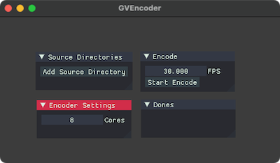

# GVEncoder

- oF 0.11 - 0.12
- [GV Video](https://github.com/Ushio/ofxExtremeGpuVideo) Encoder using [`ofxGVTextureSerializer`](https://github.com/funatsufumiya/ofxGVTextureSerializer).
  - much faster than original [`nvtt` encoder](https://github.com/Ushio/ofxExtremeGpuVideo/tree/master/nvtt-encoder), but file size would be slightly bigger.
  - `DXT5` is only supported. (so you can use alpha channel.)
  - use max multiple cores to encode by default. (you can specify how many cores are used.)

## Usage

- drag & drop into window, a dir contains images to encode. (or add with gui)
- press `Start Encode` button.

## Dependencies

- [ofxGVTextureSerializer](https://github.com/funatsufumiya/ofxGVTextureSerializer)
- [ofxAsync](https://github.com/funatsufumiya/ofxAsync)
- [ofxImGui](https://github.com/jvcleave/ofxImGui) (note: use develop branch!)
